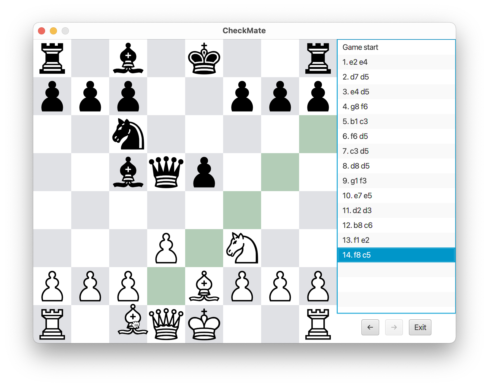
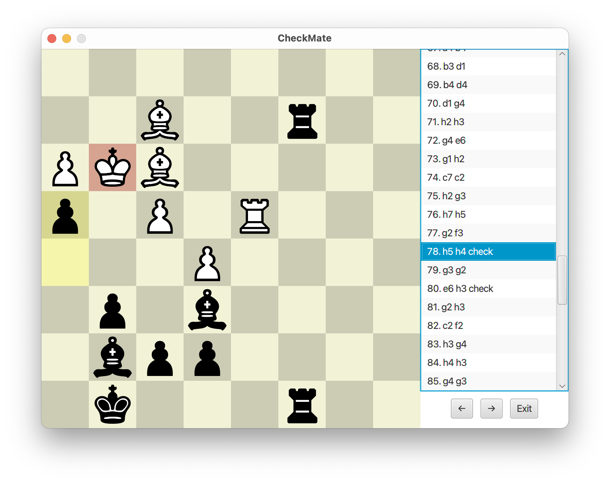

# CheckMate

Projekt na kurs Programowanie Obiektowe 2020/2021.

CheckMate to aplikacja do prowadzenia rozgrywki w szachy. Użytkownik steruje bierkami przez przeciąganie myszy.
Zaimplementowane jest podświetlanie:

- możliwych ruchów podnoszonej figury,
- ostatniego wykonanego ruchu,
- szachowanego króla.

Generowane ruchy są w pełni legalne, w szczególności specjalnie obsługiwane są ruchy takie jak:

- bicia w przelocie,
- roszady,
- promocje pionów,
- szach,
- pat oraz mat.

Możliwe tryby gry to standardowy i Chess960. Rozgrywkę można prowadzić z przeciwnikiem w trybie hotseat lub z prostym
silnikiem komputerowym.

W trybie hotseat dodatkowo gracz ma podgląd na listę historii ruchów, po której może nawigować strzałkami lub naciskając
odpowiednią komórkę na liście. Wybranie danego stanu gry jest odzwierciedlane na planszy; gracz może cofnąć ruchy i
poprowadzić rozgrywkę w inny sposób.

Widok planszy ma personalizowane kolory. Dodana także została możliwość wyboru wyglądu bierek.

## Uruchamianie

Plik jar aplikacji można pobrać w zakładce *Releases*. Aplikacja wykorzystuje platformę JavaFX.

Ze strony [https://gluonhq.com/products/javafx/](https://gluonhq.com/products/javafx/) w sekcji *Latest release* można
aktualnie pobrać JavaFX SDK w wersji 16. Do uruchomienia aplikacji będziemy potrzebowali ścieżkę do folderu lib z
pobranej paczki.

W celu uruchomienia aplikacji należy wykonać poniższe polecenie, zamieniając `PATH_TO_JAVAFX_SDK` na odpowiednią
ścieżkę.

```
java --module-path PATH_TO_JAVAFX_SDK/lib --add-modules=javafx.controls,javafx.fxml -jar Checkmate.jar
```

## Zrzuty ekranu




